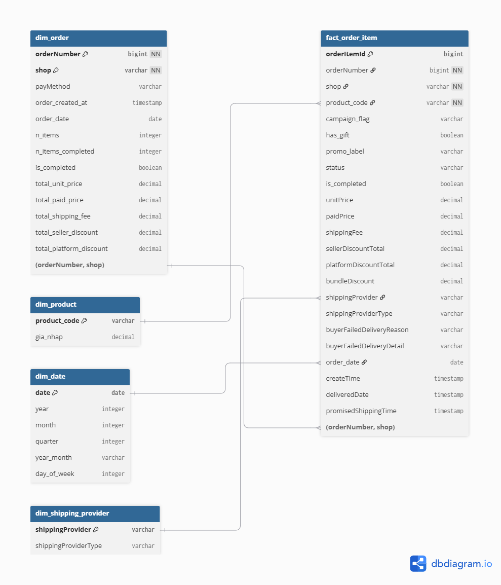
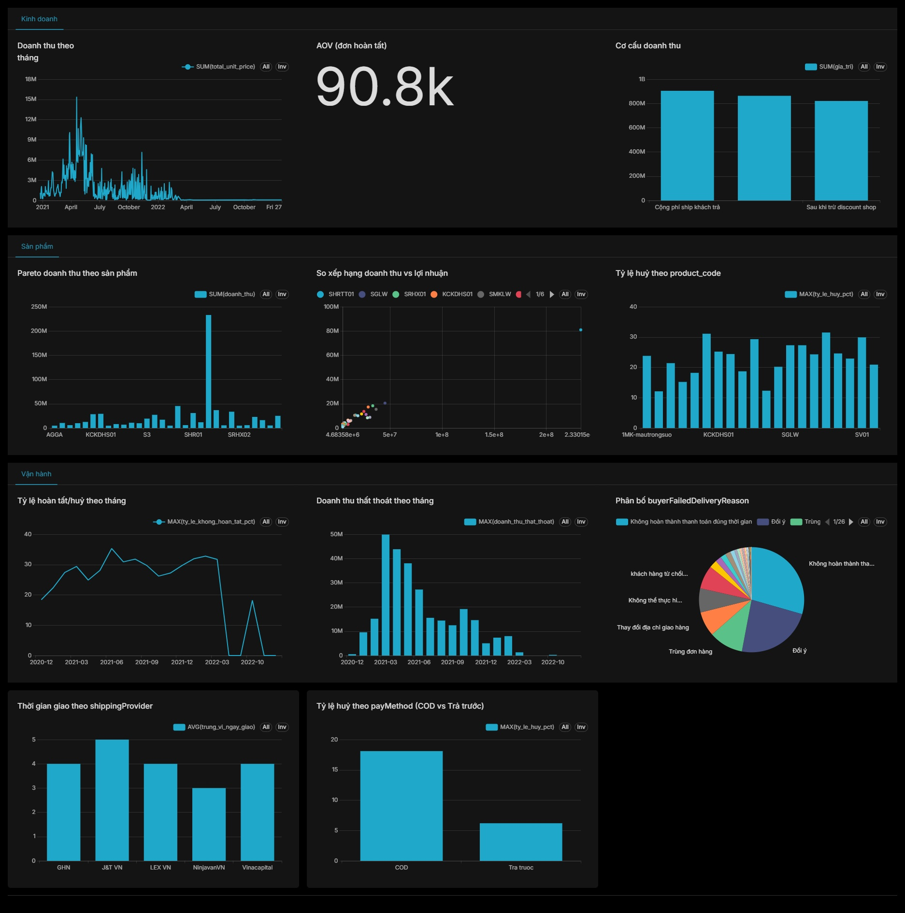

# Phân tích đơn hàng Lazada — 2 gian hàng, 12/2020 – 01/2023

## Tóm tắt

Phân tích 33.636 dòng đơn hàng (14.330 đơn) từ 2 gian hàng Lazada tự vận hành
(Chetanic, Lumytive), 12/2020 – 01/2023. Dựng mô hình star schema trong
DuckDB, làm sạch 457 mã SKU lệch chuẩn về 196 mã gốc, và trả lời ba câu hỏi
kinh doanh cụ thể: vì sao ~28,5% đơn không hoàn tất và mất bao nhiêu tiền,
flash sale có thực sự lãi hơn hàng thường không, và chi phí thật của việc phụ
thuộc COD (79% đơn) là gì. Toàn bộ dữ liệu khách hàng (tên, SĐT, địa chỉ) đã
bị loại bỏ trước khi xử lý.

## Bối cảnh

Hai gian hàng Lazada trong dữ liệu này do tôi tự vận hành. Đây không phải bộ
dữ liệu công khai — là dữ liệu kinh doanh thật, dùng để luyện phân tích và làm
portfolio ứng tuyển vị trí Data Analyst.

## Nguồn dữ liệu và xử lý PII

| File gốc | Nội dung |
|---|---|
| `Chetanic.xlsx` | 32.452 dòng order-item, 13.579 đơn |
| `Lumytive.xlsx` | 1.184 dòng, 751 đơn |
| `Lãi_chưa_trừ_chi_phí.xlsx` | Bảng giá vốn, 117 sản phẩm |

Mỗi dòng là một order-item, không phải một đơn — số lượng mua thể hiện bằng số
dòng, không có cột quantity. `python/01_clean.py` gộp 2 shop, loại **31 cột
chứa thông tin cá nhân** (tên, email, SĐT, địa chỉ, mã số thuế...) ngay bước
đầu tiên, trước khi xử lý bất cứ thứ gì khác. Dữ liệu gốc (`data/raw/`) không
bao giờ rời khỏi máy cá nhân — không commit lên git (`.gitignore` chặn
`data/raw/`, `*.xlsx`, `*.duckdb`).

Nhật ký đầy đủ mọi vấn đề dữ liệu gặp phải: [`docs/data_quality.md`](docs/data_quality.md).

## Mô hình dữ liệu

Star schema trong DuckDB (`sql/01_schema.sql`) — 1 fact table + 4 dimension:

- **`fact_order_item`** — bảng fact, grain = 1 dòng = 1 lần mua 1 SKU trong 1
  đơn (mức chi tiết thấp nhất có trong dữ liệu). Chứa các số đo cộng dồn được:
  `unitPrice`, `paidPrice`, `shippingFee`, `sellerDiscountTotal`,
  `platformDiscountTotal`.
- **`dim_order`** — khoá kép `(orderNumber, shop)`, không phải `orderNumber`
  một mình (xem phần "Phát hiện dữ liệu quan trọng" bên dưới). Tổng hợp từ
  fact theo đơn: tổng tiền, số dòng, trạng thái hoàn tất.
- **`dim_product`**, **`dim_date`**, **`dim_shipping_provider`** — dimension
  mô tả chuẩn.
- **`dim_order_customer`** / **`fact_order_item_customer`** — 2 view lọc bỏ
  414 đơn vận hành nội bộ, dùng cho MỌI phân tích hành vi khách hàng (xem
  bên dưới).

## Bài toán ánh xạ SKU

`sellerSku` không khớp trực tiếp với bảng giá vốn — người vận hành tạo mã mới
mỗi khi chạy chương trình khuyến mãi hoặc mở gian hàng thứ hai, nên 457 mã
`sellerSku` gốc thực chất chỉ là biến thể của **196 mã sản phẩm gốc**.

- Ánh xạ tay 158/196 mã gốc (`Bang_anh_xa_SKU_giavon.xlsx` → `data/clean/sku_mapping.csv`), phủ gần như 100% doanh thu.
- Tách 2 nguồn tín hiệu chiến dịch độc lập: hậu tố `sellerSku` (`-FS`/`-FS2`/`-FS3` = flash sale, `-SL`/`-sticker` = có quà tặng) và tiền tố `itemName` trong ngoặc vuông (`[FREESHIP]`, `[HOT TREND 2021]`...) → cột `campaign_flag`, `has_gift`, `promo_label` (`python/02_parse_sku.py`).
- Hậu tố chiến dịch trong dữ liệu thật không đồng nhất (`CTFS`, `HRMN-coolFS` dính liền, không có dấu `-`) — dùng regex khớp cuối chuỗi thay vì khớp chính xác.
- `product_code` khớp theo **mã gốc dài nhất làm prefix** của `sellerSku`, không tự strip suffix — vì một số mã (`CTFS`, `CTSL`) đã coi campaign là một phần của mã sản phẩm ngay trong bảng giá vốn, strip máy móc sẽ vỡ khớp nối giá vốn.

Chi tiết đầy đủ: mục 6, 7, 10, 11 trong `docs/data_quality.md`.

## Chất lượng dữ liệu — phát hiện quan trọng nhất

Ba phát hiện làm thay đổi con số headline của cả project (chi tiết đầy đủ ở
[`docs/data_quality.md`](docs/data_quality.md)):

1. **`orderNumber` không phải khoá duy nhất giữa 2 shop** — 6 đơn trùng
   `orderNumber` giữa Chetanic và Lumytive (khách mua chung giỏ hàng nhiều
   shop trong 1 lượt thanh toán). Số đơn thật: **14.330**, dùng khoá kép
   `(orderNumber, shop)`.
2. **414 đơn (≥20 sản phẩm/đơn) là cụm đơn vận hành nội bộ**, không đại diện
   cho nhu cầu khách hàng thông thường — loại hoàn toàn khỏi mọi phân tích
   hành vi khách hàng (`dim_order_customer`/`fact_order_item_customer`).
   Việc này đổi tỷ lệ đơn không hoàn tất từ ~46% xuống **28,5%**, và doanh thu
   thất thoát từ 796,5tr xuống **282,5tr**.
3. **`unitPrice` là giá niêm yết trước discount**, không phải giá thực trả.
   Lãi gộp thực nhận = `unitPrice - sellerDiscountTotal - giá vốn`
   (`platformDiscountTotal` do Lazada hoàn riêng, không trừ vào lãi shop).

## Dashboard

Dựng bằng Apache Superset (Docker), kết nối trực tiếp vào file DuckDB — 3
trang: Kinh doanh, Sản phẩm, Vận hành.

Superset chạy local qua Docker, không public hosting — cách dựng lại:
[`dashboard/README.md`](dashboard/README.md).

## Ba bài phân tích chính

### 1. Giải phẫu đơn không hoàn tất

**Câu hỏi:** Vì sao ~28,5% đơn không hoàn tất, và thất thoát bao nhiêu tiền?

**SQL:** [`sql/02_phan_tich_1_don_khong_hoan_tat.sql`](sql/02_phan_tich_1_don_khong_hoan_tat.sql)

**Kết quả:** Tổng thất thoát 282,5 triệu (12/2020–03/2022). Lý do lớn nhất —
**"Không hoàn thành thanh toán đúng thời gian"** (1.168 đơn, 71,75tr, 29,4%
tổng thất thoát): 99,7% chưa từng chọn xong phương thức thanh toán, tức bỏ
ngang ngay bước checkout. Lý do "Thời gian giao hàng quá lâu" (150 đơn) hoá ra
bị huỷ trong **chưa đầy 1 ngày**, TRƯỚC khi có `shippingProvider` — không
phải lỗi vận chuyển, mà là bỏ đơn sớm trong lúc shop xử lý.

**Đề xuất:** Nhắc thanh toán tự động trong khung giờ vàng trước khi hết hạn
giữ đơn — nhóm lý do lớn nhất và dễ can thiệp nhất.

**Giới hạn:** Không có khoá khách hàng (đã loại PII) nên không xác định được
cặp "đơn trùng" thật — chỉ đo được tốc độ hệ thống phát hiện & xử lý, không
đo được khoảng cách thời gian giữa 2 lần đặt của khách.

### 2. Flash sale có thật sự lãi không?

**Câu hỏi:** So `campaign_flag = FS*` với hàng thường trên cùng `product_code`.

**SQL:** [`sql/03_phan_tich_2_flash_sale.sql`](sql/03_phan_tich_2_flash_sale.sql)

**Kết quả:** Với sản phẩm chủ lực SHRTT01 (55% mẫu đủ dữ liệu) — lãi gộp/đơn
khởi tạo gần như bằng nhau giữa Flash Sale và hàng thường (12.949đ so với
13.159đ), tỷ lệ huỷ cũng gần bằng nhau (33,5% so với 31,1%). **Bác bỏ giả
thuyết "flash sale huỷ nhiều hơn nên kém lãi hơn"** — nhưng cũng bác bỏ kỳ
vọng "flash sale lãi vượt trội", vốn chỉ đúng ở vài sản phẩm mẫu nhỏ, ít đại
diện.

**Đề xuất:** Quyết định chạy flash sale nên dựa vào mục tiêu khác (sản
lượng, nhận diện) thay vì kỳ vọng lãi gộp cao hơn.

**Giới hạn:** Kết luận chính chỉ dựa vững vào 1 sản phẩm — 15 sản phẩm còn lại
mẫu quá nhỏ để đại diện cho toàn bộ danh mục.

### 3. Chi phí thật của COD

**Câu hỏi:** COD chiếm ~79-91% đơn — so doanh thu thực nhận/đơn khởi tạo với
trả trước.

**SQL:** [`sql/04_phan_tich_3_cod.sql`](sql/04_phan_tich_3_cod.sql)

**Kết quả:** Tỷ lệ huỷ COD cao gấp **~3 lần** trả trước (18,1% so với 6,2%) —
đây là chi phí thật. Nhưng doanh thu/đơn khởi tạo của COD vẫn cao hơn trả
trước (69.348đ so với 58.039đ) nhờ giá trị đơn hàng lớn hơn — **COD không ăn
mòn doanh thu**, chi phí nằm ở vận hành ẩn (đóng gói, giao thất bại) không thể
hiện trực tiếp trong dữ liệu doanh thu.

**Đề xuất:** Không giảm tỷ trọng COD vì lo ngại doanh thu — tập trung giảm tỷ
lệ huỷ COD cụ thể (xác nhận đơn giá trị cao trước khi đóng gói).

**Giới hạn:** Không có cột phí dịch vụ COD do Lazada thu riêng (nếu có) trong
dữ liệu xuất ra.

## Kết luận và giới hạn chung

Không có dữ liệu traffic nên không tính được tỷ lệ chuyển đổi. Không có khoá
khách hàng đáng tin (đã loại PII) nên không đo được mua lại. Giá vốn do người
vận hành cung cấp, không từ hệ thống. Chỉ là 2 gian hàng Lazada, không phải
toàn bộ hoạt động đa kênh. Lumytive quá nhỏ (751 đơn) nên không so sánh trực
tiếp với Chetanic được.
